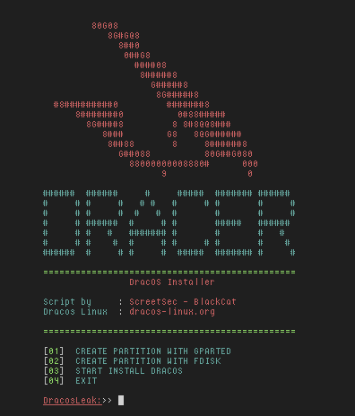

# DRACER
DRACER (DracOS Installer) a script to install DracOS Vairusa 1.0 or Leak 2.0 dualboot or multiboot. This installer is used to simplify the installation DracOS for new DracOS user and tools used for installation is rsync and squashfs-tools. 

# HOW TO USE?

1.Clone to your system.

      $ git clone https://github.com/Screetsec/super-dracos

2.Enter the directory.

      $ cd super-dracos/DRACER
   

3.Run the script!

      $ sudo chmod +x DracosInstaller.sh

      $ sudo ./DracosInstaller

# Required
+ squashfs-tools
+ rsync

# PREVIEW

# Credits
+ Thanks to Allah
+ Edo -maland- [[ScreetSec]](https://github.com/Screetsec)
+ [DracOS Linux ( Penetration os )](http://dracos-linux.org/) from Indonesia

# BUG

Submit new issue.
